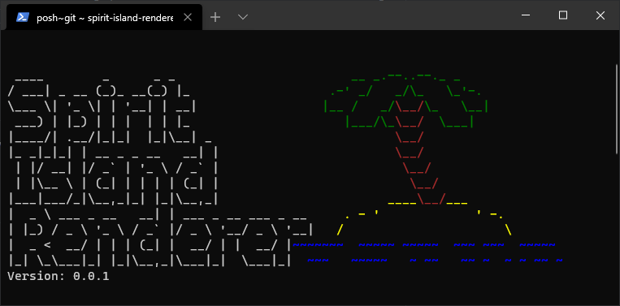

# Spirit Island Renderer



This tool renders custom spirits and there unique powers. It uses [spirit-island-template](https://github.com/Gudradain/spirit-island-template) and render those with [node-html-to-image](https://github.com/frinyvonnick/node-html-to-image). Check out [what's new](CHANGELOG.md).


## Getting started

>You need to have [node](https://nodejs.org/) installed. We assume you have added it to your PATH when you installed it.

Install the Program

```bash
# this isntalls the tool globally so it will be available in cmd
npm i spirit-island-renderer@latest -g
```

The fastest way is to start is with the sample.

```bash
# This generates an folder myTestSpirt and put the sample inside
spirit-island-renderer --generate-sample myTestSpirit

# This will generate the sample spirit
spirit-island-renderer myTestSpirit\Ashes-renews-the-land.json

# now you'll find the images of the spirit in the out folder
```

Take a look at `myTestSpirut/Ashes-renews-the-land.json`. Changing some values and executing `npx spirit-island-renderer myTestSpirit\Ashes-renews-the-land.json` from the parent folder again will change the images of the spirit. Try it out.

If you open the JSON file in an editor that can handle JSON schema like [VSCode](https://code.visualstudio.com/Download) you get autocompletion and warnings if you put some values where they do not belong.

Execute `-h` to print the help and find out what you can do
```bash
spirit-island-renderer -h
```

Instead of using `spirit-island-renderer` you can just type `sir` after you have installed it.

------------------------------


### Sample output


## Development

When you clone do not forget the sub modules

```bash
# Init the submodules
git submodule init
git submodule update

```
you can test the code with following command
```bash
# Create your first spirit
npm run render -- <spirit-file.json>

```

If you change the spirit type you need to execute

```bash
npm run generate-schema
```

this will update the schema file.
